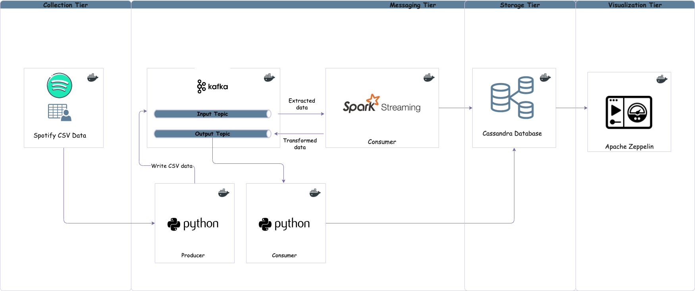
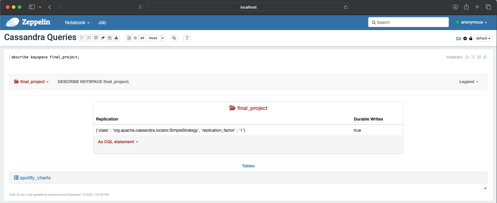
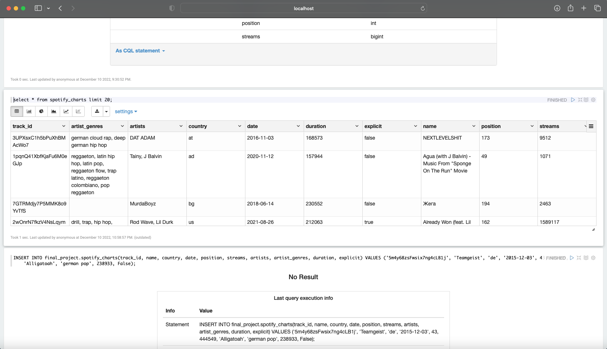

# CSCI E-88 FINAL PROJECT

**Emmanuel Aboah** </br>
**Saturday, December 10th 2022**

[youtube link](https://youtu.be/0nHVwX_OCMg)

## Project Goal and Problem Statement

Analyzing spotify streaming data from 2014 to 2022. This project will attempt to answer questions such as most popular artists, most played genre of music, countries with the most streams etc.

## Big Data Source

I will be using a [kaggle](https://www.kaggle.com/datasets/jfreyberg/spotify-chart-data) data-source. The data will be scrubbed and streamed to kafka topics. An ideal outcome will be a dashboard showing metrics on the spotify data collected.  

## Expected Results

When the pipeline is initiated, all data in the provided csv should be written to kafka, consumed, transformed and loaded to cassandra. </br>
Zepplin should be able to query the data and provide data visualization. Users can query data to answer questions like who was the most played </br>
artist on spotify in the year 2016, or the most streamed song in 2019.

## Processing Pipeline



## Outline

- **Collection Tier** A scala producer app reads a csv files.
- **Messaging Tier** Comprises of a kafka cluster and a spark streams app.
- **Storage Tier** Cassandra database.
- **Visualization Tier** Possibly kibana or Apache Zeppelin

## Pipeline Overview and Technologies used

The pipeline will be orchestrated with docker compose, up till the storage tier. The scala producer will read the csv file, clean any null fields and transform lines to data objects. The producer will then send the data objects as json messages to designated kafka topics. </br>
A spark streaming app will consume the data objects from kafka topics and perform transformations in order to pre-aggrgregate and apply algorithms that will perform initial calculations to facilitate perfomant storage in cassandra. Data will then be stored in the cassandra database. </br>
A visualization tier using kibana or zeppelin may be included depending on time. This will help provide visualization of metrics and facilitate additional queries of the stored data.

## New Technology/Framework used

- Spark streams
- Apache Zeppelin

## Implementation

Collection tier: python producer

```python
from kafka import KafkaProducer

import json

from json import loads

from csv import DictReader

bootstrap_servers = ['localhost:9092']

topicname = 'chart_input_topic'

producer = KafkaProducer(bootstrap_servers = bootstrap_servers)

producer = KafkaProducer()

with open('data/charts.csv', 'r') as new_obj:
    csv_dict_reader = DictReader(new_obj)

    for row in csv_dict_reader:
        res = producer.send(topicname, json.dumps(row).encode('utf-8'))
        metadata = res.get()

        print(metadata.topic, metadata.partition)

```

Messaging Tier: docker-compose

```yaml
version: "3.8"
networks:
  final-project:
    name: final-project-net
    driver: bridge
services:
  #Zookeeper container
  zookeeper:
    image: confluentinc/cp-zookeeper
    hostname: zookeeper
    container_name: zookeeper
    networks:
      - final-project
    ports:
      - "2181:2181"
    environment:
      ZOOKEEPER_CLIENT_PORT: 2181
      ZOOKEEPER_TICK_TIME: 2000

  #Kafka container node1
  broker1:
    image: confluentinc/cp-server
    hostname: broker1
    container_name: broker1
    healthcheck:
      test: nc -z localhost 9092
    networks:
      - final-project
    depends_on:
      - zookeeper
    ports:
      - "9092:9092"
#      - "9101:9101"
    environment:
      KAFKA_BROKER_ID: 1
      KAFKA_ZOOKEEPER_CONNECT: 'zookeeper:2181'
      KAFKA_LISTENER_SECURITY_PROTOCOL_MAP: PLAINTEXT:PLAINTEXT,PLAINTEXT_HOST:PLAINTEXT
      KAFKA_INTER_BROKER_LISTENER_NAME: PLAINTEXT
      KAFKA_ADVERTISED_LISTENERS: PLAINTEXT://broker1:29092,PLAINTEXT_HOST://localhost:9092
      KAFKA_LISTENERS: PLAINTEXT://:29092,PLAINTEXT_HOST://:9092
      KAFKA_METRIC_REPORTERS: io.confluent.metrics.reporter.ConfluentMetricsReporter
      KAFKA_OFFSETS_TOPIC_REPLICATION_FACTOR: 1
      KAFKA_GROUP_INITIAL_REBALANCE_DELAY_MS: 0
      KAFKA_CONFLUENT_LICENSE_TOPIC_REPLICATION_FACTOR: 1
      KAFKA_CONFLUENT_BALANCER_TOPIC_REPLICATION_FACTOR: 1
      KAFKA_TRANSACTION_STATE_LOG_MIN_ISR: 1
      KAFKA_TRANSACTION_STATE_LOG_REPLICATION_FACTOR: 1
      KAFKA_JMX_PORT: 9101
      KAFKA_JMX_HOSTNAME: localhost
      KAFKA_CONFLUENT_SCHEMA_REGISTRY_URL: http://schema-registry:8081
      CONFLUENT_METRICS_REPORTER_BOOTSTRAP_SERVERS: broker1:29092
      CONFLUENT_METRICS_REPORTER_TOPIC_REPLICAS: 1
      CONFLUENT_METRICS_ENABLE: 'false'
      CONFLUENT_SUPPORT_CUSTOMER_ID: 'anonymous'
#Kafka container node2
  broker2:
    image: confluentinc/cp-server
    hostname: broker2
    container_name: broker2
    networks:
      - final-project
    depends_on:
      - zookeeper
    ports:
      - "9093:9093"
#      - "9101:9101"
    environment:
      KAFKA_BROKER_ID: 2
      KAFKA_ZOOKEEPER_CONNECT: 'zookeeper:2181'
      KAFKA_LISTENER_SECURITY_PROTOCOL_MAP: PLAINTEXT:PLAINTEXT,PLAINTEXT_HOST:PLAINTEXT
      KAFKA_ADVERTISED_LISTENERS: PLAINTEXT://broker2:29092,PLAINTEXT_HOST://localhost:9093
      KAFKA_LISTENERS: PLAINTEXT://:29092,PLAINTEXT_HOST://:9093
      KAFKA_INTER_BROKER_LISTENER_NAME: PLAINTEXT
      KAFKA_METRIC_REPORTERS: io.confluent.metrics.reporter.ConfluentMetricsReporter
      KAFKA_OFFSETS_TOPIC_REPLICATION_FACTOR: 1
      KAFKA_GROUP_INITIAL_REBALANCE_DELAY_MS: 0
      KAFKA_CONFLUENT_LICENSE_TOPIC_REPLICATION_FACTOR: 1
      KAFKA_CONFLUENT_BALANCER_TOPIC_REPLICATION_FACTOR: 1
      KAFKA_TRANSACTION_STATE_LOG_MIN_ISR: 1
      KAFKA_TRANSACTION_STATE_LOG_REPLICATION_FACTOR: 1
      KAFKA_JMX_PORT: 9101
      KAFKA_JMX_HOSTNAME: localhost
      KAFKA_CONFLUENT_SCHEMA_REGISTRY_URL: http://schema-registry:8081
      CONFLUENT_METRICS_REPORTER_BOOTSTRAP_SERVERS: broker2:29092
      CONFLUENT_METRICS_REPORTER_TOPIC_REPLICAS: 1
      CONFLUENT_METRICS_ENABLE: 'false'
      CONFLUENT_SUPPORT_CUSTOMER_ID: 'anonymous'

  zeppelin:
    image: apache/zeppelin:0.8.0
    networks:
      - final-project
    environment:
      ZEPPELIN_PORT: 8080
      ZEPPELIN_JAVA_OPTS: >-
        -Dspark.driver.memory=1g
        -Dspark.executor.memory=2g
      SPARK_SUBMIT_OPTIONS: >-
        --conf spark.driver.host=localhost
        --conf spark.driver.port=8081
        --conf spark.es.port=9200
        --packages datastax:spark-cassandra-connector:2.0.0-M2-s_2.11
        --conf spark.cassandra.connection.host=cassandra
        --conf cassandra.hosts=cassandra
      MASTER: local[*]
    links:
      - cassandra:cassandra
    ports:
      - 8080:8080
      - 8081:8081
      - 4040:4040
    privileged: false
    volumes:
      - ./znotebooks:/usr/zeppelin/notebook
  cassandra:
    networks:
      - final-project
    image: cassandra
    ports:
      - 7002:7002
      - 7001:7001
      - 9042:9042
      - 9160:9160
      - 7199:7199
    volumes:
      - ./cdata:/var/lib/cassandra

```

Messaging Tier: Spark Stream Consumer/ Producer

```scala
package org.cscie88.final_project

import org.apache.spark.sql.functions.{col, from_json, udf}
import org.cscie88.final_project.Chart._
import org.cscie88.final_project.ReadChartLinesJob.readConfig
import org.cscie88.utils.SparkUtils
import org.cscie88.week5.SparkRDDConfig

object ConsumeChartLinesJob {

  def transformToInt = (str: Option[String]) => {
    str match {
      case Some(o) => o.trim.toInt
      case None    => 0
    }
  }

  def transformToLong = (str: Option[String]) => {
    str match {
      case Some(o) => o.trim.toLong
      case None    => 0
    }
  }

  def transformToBoolean = (str: Option[String]) => {
    str match {
      case Some(o) => o.trim.toBoolean
      case None    => false
    }
  }

  def replaceChars = (str: Option[String]) => {
    str match {
      case Some(ar) => ar.trim.replaceAll("\\[|\\]|\\'", "")
      case None     => "none"
    }
  }

  val transformToIntUdf = udf(transformToInt)
  val transformToLongUdf = udf(transformToLong)
  val transformToBooleanUdf = udf(transformToBoolean)
  val replaceCharsUdf = udf(replaceChars)

  def main(args: Array[String]): Unit = {
    implicit val conf: SparkRDDConfig = readConfig()

    val spark = SparkUtils.sparkSession(conf.name, conf.masterUrl)

    import spark.implicits._

    val df = spark.readStream
      .format("kafka")
      .option(
        "kafka.bootstrap.servers",
        "localhost:9092"
      )
      .option("subscribe", "chart_input_topic")
      .option("startingOffsets", "latest")
      .option("failOnDataLoss", "false")
      .load()
      .selectExpr("CAST(value AS STRING)")
      .select(from_json(col("value"), chartSchema).as[Chart])
      .withColumn("position", transformToIntUdf(col("position")))
      .withColumn("streams", transformToLongUdf(col("streams")))
      .withColumn("artists", replaceCharsUdf(col("artists")))
      .withColumn("artist_genres", replaceCharsUdf(col("artist_genres")))
      .withColumn("duration", transformToLongUdf(col("duration")))
      .withColumn("explicit", transformToBooleanUdf(col("explicit")))

    // Write to kafka topic
    df.selectExpr("CAST(track_id AS STRING) AS key", "to_json(struct(*)) AS value")
      .writeStream
      .format("kafka")
      .option("kafka.bootstrap.servers", "localhost:9092")
      .option("topic", "chart_output_topic")
      .option("checkpointLocation", "~/tmp/output_topic/checkpoint")
      .start()
      .awaitTermination()

  }
}

```

Storage Tier: Python conssumer -> Cassandra

```python
import json
from kafka import KafkaConsumer
from cassandra.cluster import Cluster
from uuid import uuid1

if __name__ == "__main__":
    consumer = KafkaConsumer(
        "chart_output_topic", bootstrap_servers="localhost:9092", auto_offset_reset="earliest"
    )

    cluster = Cluster(["localhost"], port=9042)
    session = cluster.connect("final_project")

    count = 0

    for messages in consumer:
        charts_data = json.loads(messages.value)

        query = f"""
                INSERT INTO final_project.spotify_charts(track_id, name, country, date, position, streams, artists, artist_genres, duration, explicit) VALUES ('{charts_data["track_id"]}', '{charts_data["name"]}', '{charts_data["country"]}', '{charts_data["date"]}', {charts_data["position"]}, {charts_data["streams"]}, '{charts_data["artists"]}', '{charts_data["artist_genres"]}', {charts_data["duration"]}, {charts_data["explicit"]});
                """.strip()

        try:
            session.execute(query)
            count += 1
        except:
            print("Trouble reading record")
            pass
        print(f"completed writing records {count}")

```

## Results

Zepple Notebooks and dashboard</br>




## Conclusions and Lessons learned

- Streaming with scala ended up being challenging while tryin to parse complex csv lines.
- Zeppelin was hard to configure, I ended up orchestrating with docker-compose.
- Cassandra connector and cluster set-up was a challenge as dse images would not work on mac M1 chip.